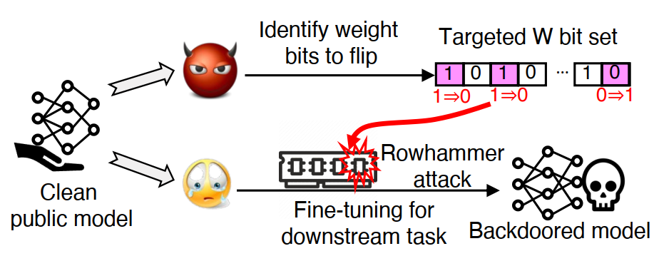

# WBP: Training-time Backdoor Attacks through Hardware-based Weight Bit Poisoning

WBP (i.e., **W**eight **B**it **P**oisoning) is a novel *task-agnostic backdoor attack* that manifests during the victim’s training time (i.e., fine-tuning from a public and clean PTM) by inducing hardware-based weight bit flips (using rowhammer). The attack allows an adversary to generate *ONE set of bit flips* that can trojan all downstream models fine-tuned with the same PTM, without the requirement to know the downstream tasks or dataset. Essentially, this attack demonstrates that weight perturbations can also transfer. WBP utilizes a distance-aware algorithm that identifies bit flips to maximize the distance between the distribution of poisoned output representations (ORs) and clean ORs based on the public PTM. The evaluation demonstrates that WBP can compromise a wide range of PTMs and downstream tasks with an average 99.3% attack success rate by flipping as few as 11 model weight bits. 

## Overview

Machine learning models, particularly DNNs, are increasingly adopted across various application domains. Ensuring the security and trustworthiness of these models is crucial. WBP showcases a novel method of exploiting the fine-tuning process to inject backdoors into DNN models, even when both data and models are trusted.

<p align="center">
  
</p>

<p align="center"><em>Figure 1: Overview of the WBP attack pipeline.</em></p>
Key aspects of WBP:

1. **Overview**: At a high level, WBP manifests as a multi-round attack framework with an offline stage (for trigger and bit flips generation) and an online stage (for rowhammer-based fault injection). Finally, WBP forges the backdoored model after victim's regular fine-tuning (at model inference stage). 
2. **Offline stage**: The offline stage involves the attacker’s local search of weight bits to flip, together with the generation of an input trigger (δ) with the help of Maximum Mean Discrepancy (MMD) Optimization.
4. **Online stage**: In the online stage, WBP leverages rowhammer to correspondingly flip bit with a fixed fine-tuning interval during the victim’s model fine-tuning.

## Prerequisites

- Python 3.9 or higher
- PyTorch 1.13 or higher

## Project Structure

- **saved_file**: Directory for saving intermediate and final results.
- **SlurmResults**: Directory for logs.
- **bitflip & trigger**: Directory for saving bitflips and trigger.
- **dataloader.py**: Dataset used in our paper.
- **wbp_kernel.py**: Implements the main attack algorithm (**offline stage**).
- **bit_reduction.py**: Implements the progressive bit reduction algorithm.
- **ImageManager.py**: Aims to synthesize and manage triggered samples.
- **loss.py**: Trigger loss, backdoor loss for searching bit flips
- **main.py**: The main file for running the WBP attack (including both offline and online stages).
- **model.py**: Models used in our experiments.
- **run_script.py**: A Python script to run major experiments
- **utils.py**: All related functions


## Installation

```bash
git clone https://github.com/casrl/WBP
```
## Data preparation

```bash
cd .data
wget https://sid.erda.dk/public/archives/daaeac0d7ce1152aea9b61d9f1e19370/GTSRB_Final_Training_Images.zip
```

## Usage
- All scripts are run like: ``` python run_script.py ``` 
- ```run_script.py``` is able to launch 1. ```local search``` to identify trigger and bit flips, 2. ```remote attack``` to simulate the fault injection process along with victim's fine-tuning
- Make sure to modify the python path ```in cmd_generation() in run_script.py``` to your interpreter path: e.g., ```/home/cc/anaconda3/envs/your_conda_environment_path/ ```
<!-- space between two lines -->
- Offline search to identify trigger and bit flips: the trigger and bit flips will be saved in directory: ```trigger/``` and ```bitflips/```. All the intermediate & final results will be saved in ```saved_file/```.
  - To run offline search:
    ```bash
    nohup python -u run_script.py --attack_type local_search >> nohup.out & 
    ```
  - To run progressive bit reduction (PBR) with identified bit flips:
    ```bash
    nohup python -u run_script.py --attack_type local_search --bit_reduction greedy --inherit_slurm 'xxx' >> nohup.out & 
    # please replace 'xxx' with the index of local/offline search results e.g., '10002'.
    ```
    
  - To run offline search with progressive bit reduction (PBR) sequentially:
    ```bash
    nohup python -u run_script.py --attack_type local_search --bit_reduction greedy --inherit_slurm 'no' >> nohup.out &
    ```
  
<!-- space between two lines -->
- Online stage to inject bit flips: the result (attack success rate and accuracy) can be found in log file ```SlurmResults/```. In this step, victim process will launch the regular fine-tuning task, the attack process will inject bits during the fine-tuning (simulation)
  - To run online stage with the default WBP configurations:
      ```bash
      nohup python -u run_script.py --attack_type remote_finetune --inherit_slurm 'xxx' >> nohup.out &  
      ```
